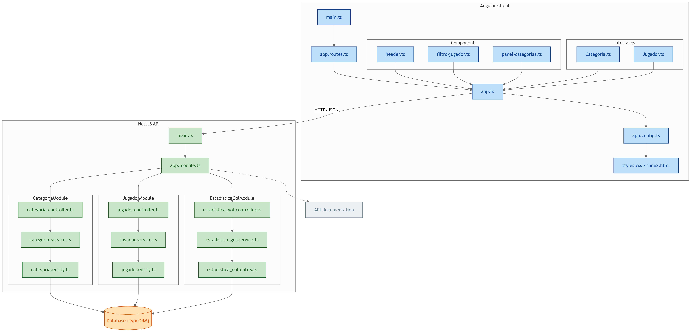

# Golazo Rup

Este proyecto es una aplicación web desarrollada con Angular y NestJS que permite la gestión de jugadores de fútbol, sus categorías y estadísticas. El sistema centraliza el registro y la administración de jugadores, ofrece endpoints para listar y cargar datos desde fuentes externas, y facilita el seguimiento del rendimiento mediante métricas como goles y participaciones.

La aplicación tiene como objetivo ofrecer un minijuego inspirado en el reto de los 7500 creado por el influencer de fútbol Roberto Rupa. El sistema presenta un filtro dinámico de jugadores, con una experiencia similar al formato de selección en TikTok, donde finalmente se elige un futbolista.

El usuario debe asignar al jugador elegido una categoría que corresponde a las principales competiciones y estadísticas del fútbol, tales como ligas, torneos internacionales, goles totales, entre otras. Algunas categorías incluyen multiplicadores especiales, lo que añade un componente estratégico: escoger la categoría correcta puede ser clave para alcanzar la meta de los 50 goles, al menos en esta versión.

### Tecnologías usadas

| Categoría        | Tecnología / Herramienta | Descripción |
|------------------|---------------------------|-------------|
| **Frontend**     | Angular                   | Framework para la construcción de la interfaz de usuario dinámica y modular. |
| **Backend**      | NestJS                    | Framework basado en Node.js para la creación de APIs escalables y estructuradas. |
| **Base de Datos**| Oracle SQL                | Sistema de gestión de bases de datos relacional para el almacenamiento de información. |
| **APIs**         | REST API                  | Comunicación entre el frontend y backend a través de servicios RESTful. |
| **Testing / Docs** | Postman                  | Pruebas y documentación de las solicitudes a las APIs. |

### Estructura del proyecto

  
### Funcionalidades principales

* Filtro de jugadores.
* Panel de categorías.
* Contador de goles.

[Vídeo demo](https://drive.google.com/file/d/1M6dsLzVhi31MtD6DiT--1zYKhkolF2eB/view?usp=sharing)

### Endpoints principales

Los endpoints usaron se encuentran documentados en el siguiente link:

[Documentación de endpoints con Postman](https://documenter.getpostman.com/view/23745776/2sB3BKGU1v)

Hay que tomar el cuenta que los endpoints están enfocados en el entorno local, es por eso que tiene el localhost en la url.

### Estado del proyecto
Este proyecto se encuentra en fase de desarrollo o al menos se terminó una primera versión. El despliegue se realizará próximamente.

### Notas adicionales
* Sólo están disponibles los datos de los jugadores entre los años 2021 y 2023, debdio a que la aplicación usa el plan gratuito del servicio de API-Football, donde sólo se pueden realizar 100 requests por día.

### Autor / Contacto
* **Nombre**: Víctor Silva.
* **Linkedin**: https://www.linkedin.com/in/victsilva37

